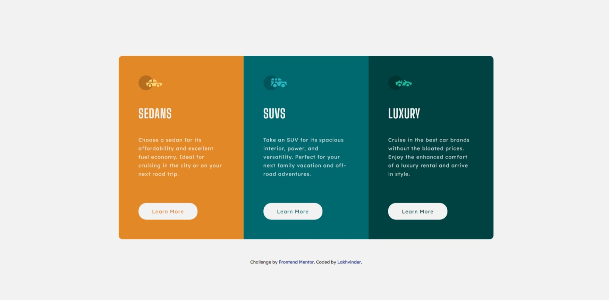

# Frontend Mentor - Order summary card solution

This is a solution to the [3-column preview card component challenge on Frontend Mentor](https://www.frontendmentor.io/challenges/3column-preview-card-component-pH92eAR2-). Frontend Mentor challenges help you improve your coding skills by building realistic projects

## Links ! 👋

- Live Site URL [Add solution URL here](https://ls6375.github.io/Frontend-Projects_Frontend-Mentor/3.%203-column-preview-card-component-main/)
- Solution URL [Add live site URL here](https://www.frontendmentor.io/solutions/column-preview-card-YuXoqK-RG)

## Built withṣ

- HTML5 markup
- CSS custom properties
- Scss

## Author

- Frontend Mentor - [@Ls6375](https://www.frontendmentor.io/profile/Ls6375)
- Github - [@Ls6375](https://github.com/Ls6375)