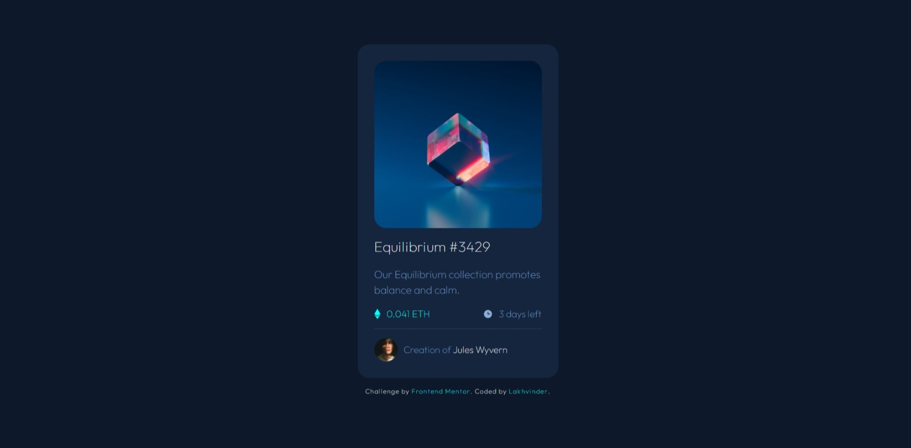

# Frontend Mentor - NFT preview card component solution

This is a solution to the [NFT preview card component challenge on Frontend Mentor](https://www.frontendmentor.io/challenges/nft-preview-card-component-SbdUL_w0U). Frontend Mentor challenges help you improve your coding skills by building realistic projects. 

## Links ! 👋

- [Live Site URL](https://ls6375.github.io/Frontend-Projects_Frontend-Mentor/4.%20nft-preview-card-component-main)
- [Solution URL](https://www.frontendmentor.io/solutions/nft-preview-card-XLHwB53a7)

## Built with

- HTML5 markup
- CSS custom properties
- Scss

## Author

- Frontend Mentor - [@Ls6375](https://www.frontendmentor.io/profile/Ls6375)
- Github - [@Ls6375](https://github.com/Ls6375)