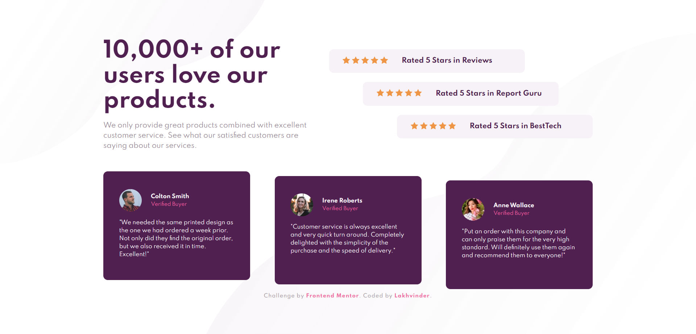

# Frontend Mentor - Social proof section solution

This is a solution to the [Social proof section challenge on Frontend Mentor](https://www.frontendmentor.io/challenges/social-proof-section-6e0qTv_bA). Frontend Mentor challenges help you improve your coding skills by building realistic projects. 

## Links ! 👋

- [Live Site URL](https://ls6375.github.io/Frontend-Projects_Frontend-Mentor/7.%20social-proof-section-master)
- [Solution URL](https://www.frontendmentor.io/solutions/)

## Built with

- HTML5 markup
- CSS custom properties
- Sass

## Author

- Frontend Mentor - [@Ls6375](https://www.frontendmentor.io/profile/Ls6375)
- Github - [@Ls6375](https://github.com/Ls6375)