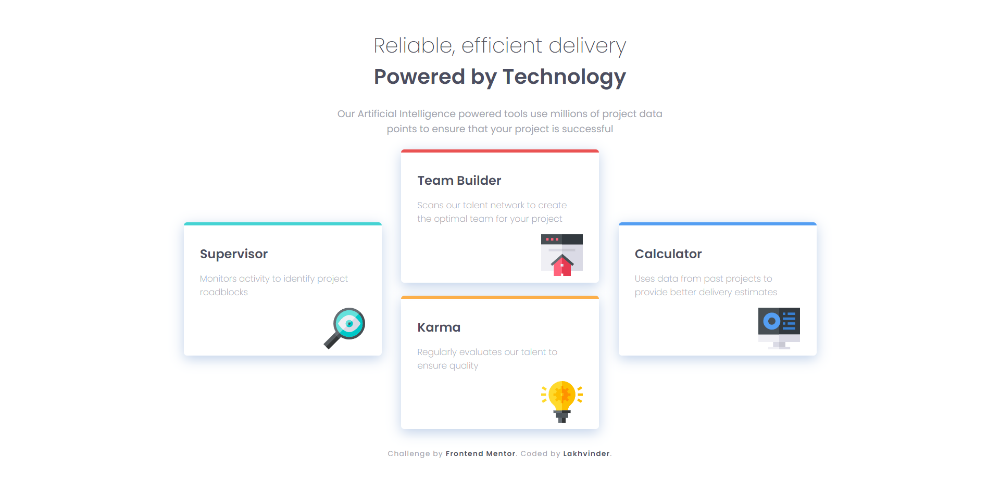

# Frontend Mentor - Four card feature section solution

This is a solution to the [Four card feature section challenge on Frontend Mentor](https://www.frontendmentor.io/challenges/four-card-feature-section-weK1eFYK). Frontend Mentor challenges help you improve your coding skills by building realistic projects. 

## Links ! 👋

- [Live Site URL](https://ls6375.github.io/Frontend-Projects_Frontend-Mentor/9_four-card-feature-section-master)
- [Solution URL](https://www.frontendmentor.io/solutions/)

## Built with

- HTML5 markup
- CSS custom properties
- Sass

## Author

- Frontend Mentor - [@Ls6375](https://www.frontendmentor.io/profile/Ls6375)
- Github - [@Ls6375](https://github.com/Ls6375)